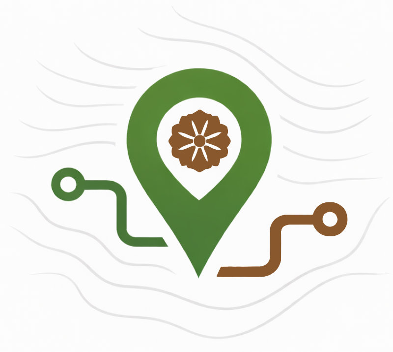

# Computing Place

  

<strong><em>Computing Place</em></strong> is a research initiative building rich, computable descriptions of places by linking environmental and cultural data. Every terrestrial Earth surface location has an environmental signature&mdash;shaped by drainage basins, elevation, climate, and ecoregion characteristics&mdash;but cultural practices and historical developments in places follow their own logic. By computing statistical and thematic signatures for environment and culture systematically and comparing how they align or diverge, platform tools aim to enable new forms of spatial and &lsquo;placial&rsquo; analysis for gazetteers and digital humanities research in multiple fields.

The platform is being developed modularly:

- **EDOP** (Environmental Dimensions of Place) — now live with 190,000+ watershed profiles using HydroATLAS data, digital elevation models, and ecoregion classifications. Includes a preliminary integration with D-PLACE cultural data, OneEarth bioregions, World Historical Gazetteer, and World Heritage Cities.

- **CDOP** (Cultural Dimensions of Place) — in development. Will add semantic and anthropological dimensions through ethnographic datasets and text embeddings derived from natural language sources.

Live at [cedop.kgeographer.org](https://cedop.kgeographer.org)

## Stack

- Python / FastAPI / PostgreSQL+PostGIS / pgvector
- Vanilla JavaScript + Leaflet + Bootstrap
- Apache / Gunicorn on Ubuntu

## Author

Karl Grossner ([kgeographer.org](https://kgeographer.org))
